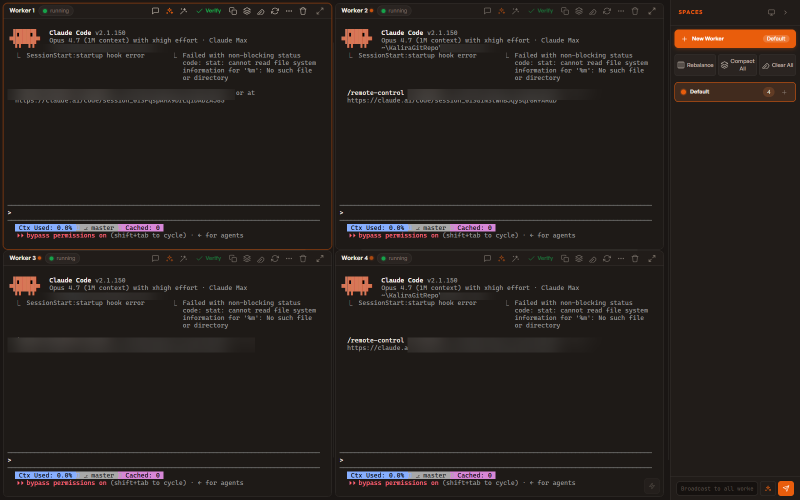
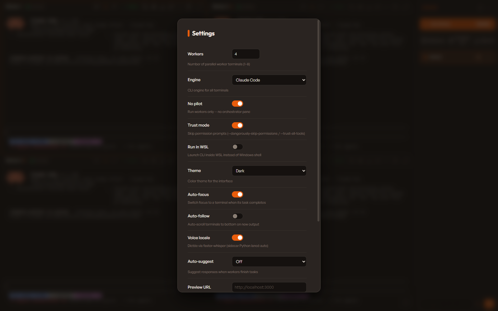
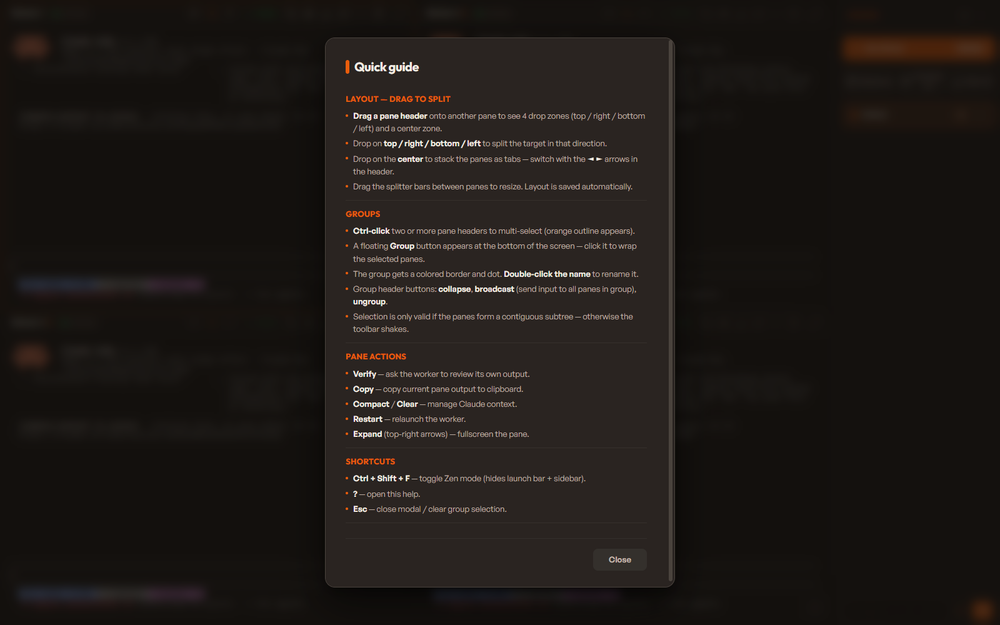

# fast-vibe

Web-based terminal multiplexer that runs **N AI coding instances** in parallel (Claude Code or Kiro CLI), with a control API, drag-to-split layout, spaces/groups, live preview, context management, voice dictation, and session persistence across restarts. Default config : **4 Claude workers, no pilot**. Optional **pilot mode** turns terminal 0 into an orchestrator that dispatches work to the others via REST.



```
┌──────────┬─────────────────────────────────────┬──────────┐
│  Spaces  │  [📁 /path/to/project]  [⚙] [Start] │          │
│ ──────── ├──────────────┬──────────────────────┤  Status  │
│ Default  │   Worker 0   │   Worker 1 / Tab     │   Panel  │
│ Group A  │  (or Pilot)  │                      │  compact │
│ Group B  ├──────────────┼──────────────────────┤  clear   │
│   +      │   Worker 2   │   Worker 3   │ ⋯ │   │  verify  │
│          │              │                      │  copy    │
└──────────┴──────────────┴──────────────┴──────┴──────────┘
                ▲ drag pane header onto another pane
                  to split (top/right/bottom/left)
                  or drop center to stack as tabs

                 Default : 4 workers, no pilot.
              Opt-in pilot mode turns Worker 0 into
            an orchestrator that drives the others via REST.
```

## Features

### Layout & spaces (3.0)

- **Layout tree** — panes, splits, tab stacks and groups. Drag a pane header onto another to split in 4 directions or drop on the center to stack as tabs.
- **Spaces sidebar** — `Default` plus per-group spaces. Switch contexts, broadcast input across a group, ungroup at any time.
- **Groups** — Ctrl-click multiple pane headers to multi-select, then wrap them with the floating Group button. Renamable, collapsible, broadcast-capable.
- **Dynamic workers** — spawn or delete workers at runtime; pane indices stay stable via slot tombstoning.
- **Balanced grid** — new panes integrate into a balanced 2-col topology; one-click **Rebalance** rebuilds the topology from scratch.
- **Overflow menu** — secondary actions collapse into a `⋯` popover when a pane is narrower than ~380px (container queries).
- **Persisted layout** — saved automatically via `/api/layout`.

Each pane header exposes the full action bar — composer, next-steps, prompts, verify, copy, compact, clear, restart, more, delete, expand :


### Engines & runtime

- **Multi-engine** — Claude Code or Kiro CLI.
- **Safe by default** — runs without permission bypass; enable Trust Mode in settings to skip prompts.
- **WSL support** — launch CLI inside WSL from a Windows host.
- **No-Pilot mode (default)** — N independent workers, no orchestrator. Best for parallel exploration.
- **Pilot + Workers (opt-in)** — turn off "No pilot" in settings to make terminal 0 an orchestrator that dispatches tasks to the others via REST (Agent tool disabled in pilot, forced curl).
- **Session persistence (3.1)** — each Claude worker spawns with `--session-id <uuid>` and reattaches via `--resume <uuid>` after server restart. State is serialized to `.session-state.json`. If the resume UUID is unknown (e.g. `~/.claude` wiped), it is detected semantically (`No conversation found`) and the worker auto-restarts on a fresh UUID instead of leaving the user stranded.



### Voice dictation (3.1)

- **100% local** via a Python `faster-whisper` sidecar — audio never leaves the machine. No more Web Speech API / Google Cloud drops.
- **Hold Ctrl+Space, talk, release** — ~1s later the transcript appears directly in the focused pane's Claude TUI input (via WS raw + bracketed-paste). Press Enter to submit, just like a typed prompt.
- **Auto-spawned sidecar** — flip the `Voice locale` setting and the server launches `scripts/whisper_sidecar.py` at boot (with health probe to avoid double-spawn). Killed cleanly on shutdown.

### UX

- **Help modal** (`?`) — quick guide for layout, groups, pane actions and shortcuts.
- **Profiles** — save/load named presets of settings + cwd.
- **Live preview** — iframe panel alongside the terminals.
- **Directory bookmarks** — favorite paths persisted across restarts.
- **Native folder picker** + **directory browser** with WSL-aware path handling.
- **Zen mode** (`Ctrl+Shift+F`) — hide sidebar and launch bar.
- **Native app mode** — `npm run app` opens a Chrome/Edge window without browser chrome.
- **Auto-focus** — switch focus to the terminal that just finished its task (configurable).
- **Auto-follow** — opt-in forced auto-scroll (off by default).
- **Themes** — dark / light / system.
- **Search** — `Ctrl+Shift+F` searches the focused terminal buffer.
- **Suggest mode** — off / static / AI suggestions next to a worker.
- **Persistent settings** — last project path, layout, profiles all saved across restarts.

Press `?` anywhere for the quick guide :



## Keyboard shortcuts

| Shortcut | Action |
|----------|--------|
| `?` | Open help |
| `Ctrl+Space` (hold) | Voice dictation into focused pane (release to transcribe) |
| `Ctrl+Shift+F` | Toggle Zen mode |
| `Ctrl+Shift+B` | Broadcast to focused group |
| `Ctrl+Shift+G` | Group selected panes |
| `Ctrl+Shift+S` | Toggle sidebar |
| `Ctrl+1` … `Ctrl+8` | Switch focused terminal |
| `Ctrl+]` / `Ctrl+[` | Cycle focused terminal |
| `Ctrl+Enter` (in compose) | Send composed prompt to its pane |
| `Ctrl+I` (in compose) | Improve composed prompt via LLM |
| `Esc` | Close modal / clear group selection / exit expanded |

## How it works


1. Open `http://localhost:3333`, click the directory input to browse folders.
2. **Default config**: 4 Claude workers, no pilot. Tweak engine, worker count, no-pilot, trust mode, voice, theme, etc. in **Settings** (⚙).
3. Click **Start** — spawns terminals with the selected engine. If a previous session is found in `.session-state.json`, a restore banner offers to resume it.
4. Rearrange panes by dragging headers; spawn / delete workers at runtime.
5. Hold **Ctrl+Space** to dictate into the focused pane (requires the whisper sidecar — see Install).
6. In pilot mode (opt-in), terminal 0 becomes the **pilot** and controls workers via `curl` (Agent tool is disabled):

```bash
# Send a task to worker 2
curl -s -X POST http://localhost:3333/api/terminal/2/send \
  -H "Content-Type: application/json" \
  -d '{"text":"implement the auth module"}'

# Read worker 2 output
curl -s http://localhost:3333/api/terminal/2/output?last=3000

# Compact / clear worker 2 context
curl -s -X POST http://localhost:3333/api/terminal/2/compact
curl -s -X POST http://localhost:3333/api/terminal/2/clear

# Spawn a new worker, or remove one
curl -s -X POST   http://localhost:3333/api/terminal/spawn
curl -s -X DELETE http://localhost:3333/api/terminal/3
```

## Install

```bash
git clone <repo-url>
cd fast-vibe
npm install
```

> Requires Node.js 18+ and one of:
> - [Claude Code CLI](https://docs.anthropic.com/en/docs/claude-code)
> - [Kiro CLI](https://kiro.dev) (`kiro-cli`)
>
> On Windows, `node-pty` needs Visual Studio Build Tools.

### Voice dictation (optional)

The voice feature relies on a local `faster-whisper` Python sidecar (no cloud, no Google).

```bash
# Once : install Python deps (downloads ~1.5GB model on first run)
pip install -r scripts/whisper_requirements.txt
```

Then enable **Voice locale** in Settings → the server will spawn the sidecar automatically at boot. Hold **Ctrl+Space** to dictate.

Optional env vars (set before `npm start`):

```
FAST_VIBE_WHISPER_PORT=8765            # sidecar port
WHISPER_MODEL=small                    # tiny / base / small / medium / large-v3
WHISPER_DEVICE=auto                    # cpu / cuda / auto
WHISPER_LANGUAGE=fr                    # ISO 639-1 code
WHISPER_COMPUTE_TYPE=int8              # int8 / float16 / float32
```

## Usage

```bash
npm start        # Build + serve → http://localhost:3333
npm run dev      # Dev mode (TS watch)
npm test         # Jest test suite
npm run typecheck
```

## API

### Settings & lifecycle

| Method | Endpoint | Description |
|--------|----------|-------------|
| `GET` | `/api/settings` | Read settings |
| `POST` | `/api/settings` | Update settings (`workers`, `previewUrl`, `engine`, `noPilot`, `trustMode`, `useWSL`, `autoFocus`, `autoFollow`, `theme`, `suggestMode`, `logsEnabled`, `localSTT`) |
| `POST` | `/api/launch` | Start terminals `{"cwd":"/path","workers":4}` |
| `POST` | `/api/stop` | Stop all terminals |
| `GET` | `/api/status` | Status of all terminals |
| `POST` | `/api/transcribe` | Multipart audio → text (proxied to local whisper sidecar) |
| `GET` | `/api/transcribe/health` | Probe the whisper sidecar |

### Terminal control

| Method | Endpoint | Description |
|--------|----------|-------------|
| `POST` | `/api/terminal/spawn` | Spawn a new worker, returns `{index}` |
| `DELETE` | `/api/terminal/:id` | Remove a worker (pilot is protected in pilot mode) |
| `POST` | `/api/terminal/:id/send` | Send text `{"text":"..."}` |
| `GET` | `/api/terminal/:id/output?last=N` | Read last N chars (ANSI stripped) |
| `POST` | `/api/terminal/:id/compact` | Compact context (keep summary) |
| `POST` | `/api/terminal/:id/clear` | Clear context (full reset) |
| `POST` | `/api/batch/compact` | Compact all workers |
| `POST` | `/api/batch/clear` | Clear all workers |

### Layout, profiles, search

| Method | Endpoint | Description |
|--------|----------|-------------|
| `GET` | `/api/layout` | Read saved layout tree |
| `POST` | `/api/layout` | Save layout `{"layout": ... }` (or `null` to clear) |
| `GET` | `/api/profiles` | List profiles |
| `POST` | `/api/profiles` | Save profile `{"name":"...","settings":{...,"cwd":"..."}}` |
| `DELETE` | `/api/profiles` | Delete profile `{"name":"..."}` |
| `GET` | `/api/search?q=...&id=N` | Search terminal buffer |

### Suggestions (AI / static)

| Method | Endpoint | Description |
|--------|----------|-------------|
| `POST` | `/api/suggest/:workerId` | Request a suggestion |
| `POST` | `/api/suggest/:workerId/send` | Accept and send |
| `POST` | `/api/suggest/:workerId/dismiss` | Dismiss |

### Bookmarks & filesystem

| Method | Endpoint | Description |
|--------|----------|-------------|
| `GET` | `/api/bookmarks` | List bookmarks |
| `POST` | `/api/bookmarks` | Add `{"path":"/my/project"}` |
| `DELETE` | `/api/bookmarks` | Remove `{"path":"/my/project"}` |
| `POST` | `/api/pick-folder` | Native OS folder picker |
| `GET` | `/api/browse?path=...` | Directory browser suggestions |

### Engine modes

| Engine | Safe mode (default) | Trust mode | Pilot support |
|--------|---------------------|------------|---------------|
| `claude` | `claude` | `claude --dangerously-skip-permissions` | ✅ with system prompt |
| `kiro` | `kiro-cli chat --tui` | `kiro-cli chat --trust-all-tools --tui` | ❌ (use no-pilot mode) |

## Stack

- **Backend** — Node.js, Express, ws, node-pty (TypeScript, compiled with `tsc`)
- **Frontend** — Vanilla TS bundled with esbuild, xterm.js (CDN), Outfit + General Sans fonts
- **Voice sidecar** — optional, Python `faster-whisper` + Flask (local, no cloud)
- **Tests** — Jest + supertest
- **3 runtime npm dependencies**, no UI framework

## License

MIT
